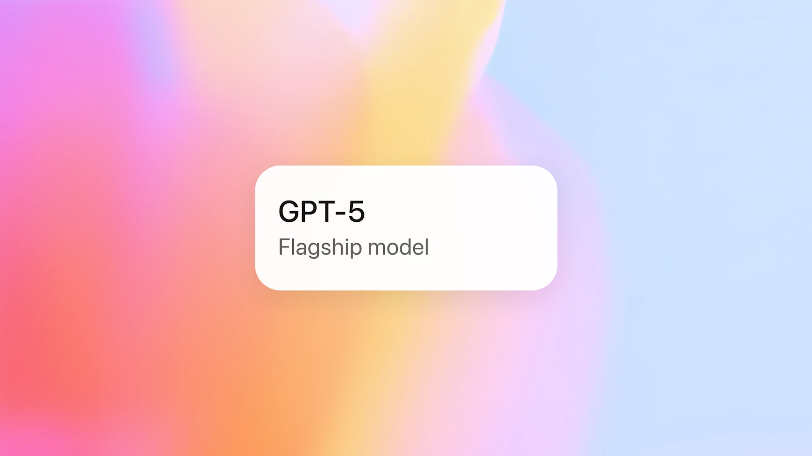

# Triwai — Portfolio

このサイトは、GPT-5 によってコーディングされました。  
洗練されたモーション、ミニマルな情報設計、シルバー/ホワイト/ダークのモノクローム美学をベースに、「知性を感じる」インタラクションを目指しています。

## 技術スタック

- HTML / CSS / JavaScript（バニラ）
- アクセシビリティとパフォーマンスを意識した軽量構成
- イントロのホログラフィック表現、粒子背景、スクロールリビールなどの演出

## OpenAI について

本プロジェクトは OpenAI の先進的な言語モデルの支援で制作されました。  
詳しくは下記をご覧ください。

- OpenAI GPT-5 公式ページ: https://openai.com/ja-JP/gpt-5/

## セットアップ

1. リポジトリをクローン
2. 任意のサーバ（もしくは拡張機能 Live Server 等）で `index.html` を開く
3. `assets/img.png` はフッターバナー画像として使用されます

## ライセンス

- 本サイトのコードは制作者の意図に従い、適切なクレジット表記のもとで利用してください。
- 画像やロゴ等、第三者の権利物は各ライセンスに従います。

© Triwai — illuminated by intelligence.
